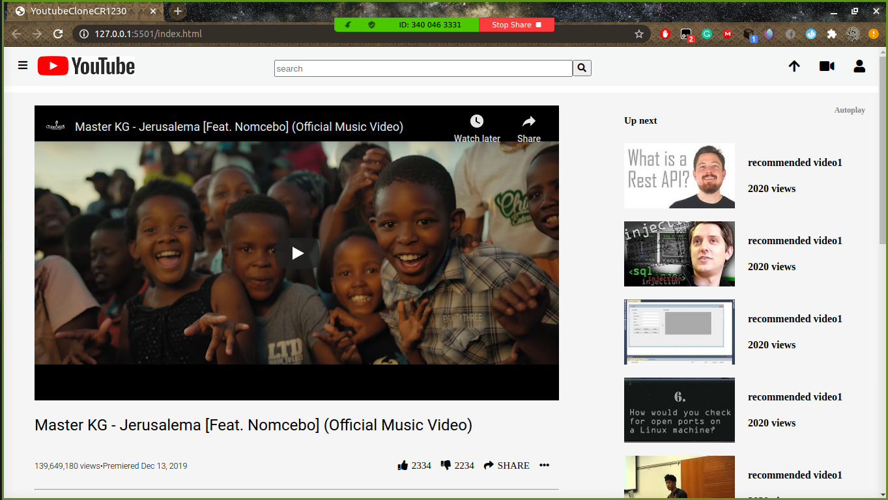

 # YoutubeCloneCR1230

 > The Youtube clone Homepage designed my Microverse students as their first project.

 

 ## Built With

 - HTML
 - CSS

 ##  Live Demo

 [Live Demo Link](https://che30.github.io/YoutubeCloneCR1230/)

## Authors

👤 **Author1**

- GitHub: [@che30](https://github.com/che30)
- Twitter: [@che55085128](https://twitter.com/che55085128)
- LinkedIn: [che nsoh](https://www.linkedin.com/in/che-nsoh-9455271b0/)

👤 **Author2**

- GitHub: [@mke2111](https://github.com/mke2111)
- Twitter: [@Roymkenya](https://twitter.com/Roymkenya)
- LinkedIn: [Roy Mukuye](https://www.linkedin.com/in/roy-mukuye-42b07b1b4)

## 🤝 Contributing

Contributions, issues, and feature requests are welcome!

## Show your support

Give a ⭐️ if you like this project!

## 📝 License

This project is [MIT](lic.url) licensed.